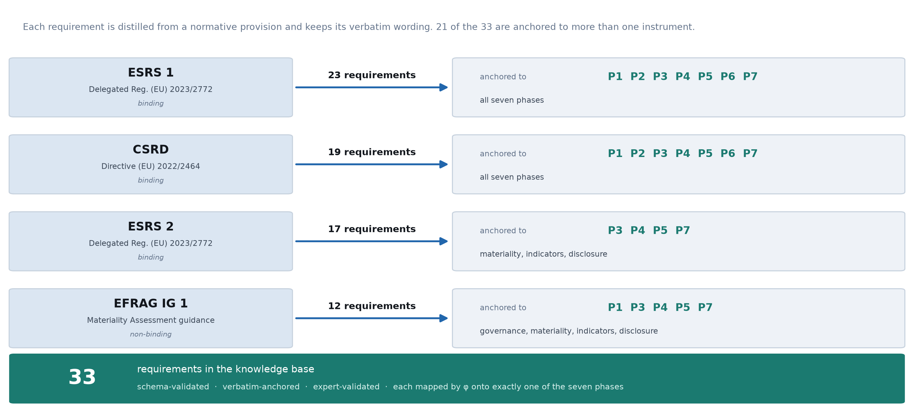
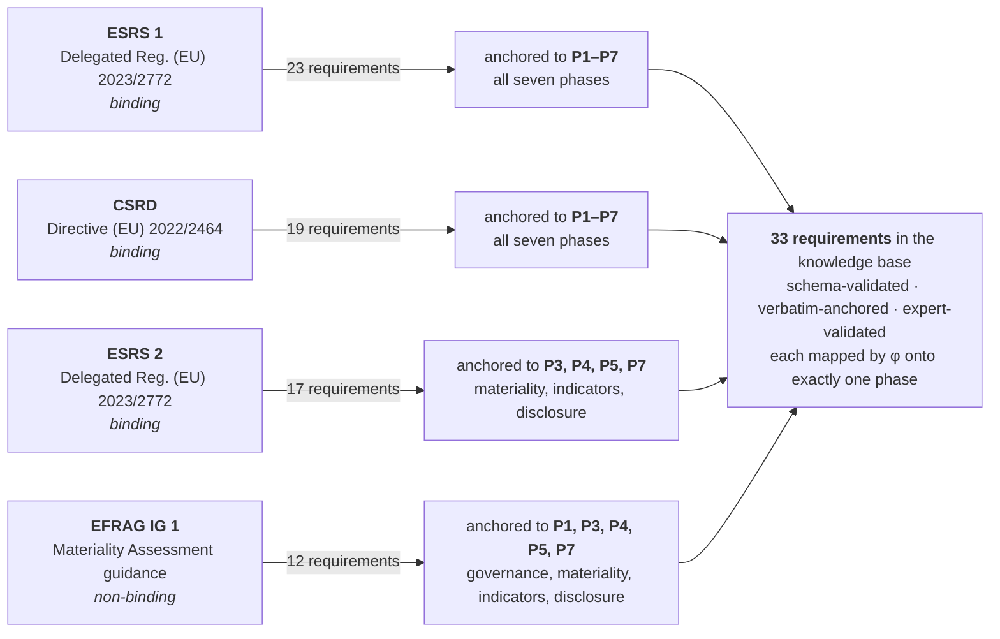

# A BPMN-Based Process Model for Double Materiality Assessment through a Neuro-Symbolic Validation Layer

**Anonymous supplementary material for double-blind review.**

This repository contains the artefacts needed to inspect and reproduce the
measurement reported in the paper: the requirements knowledge base in both human-
readable and machine-checkable form, the single prompt given to every verifier, and
the pseudocode of the end-to-end workflow.

---

## 1. What the artefact evaluates

The Corporate Sustainability Reporting Directive makes double materiality mandatory,
but the guidance prescribes *what* must be achieved, not *how*, *by whom* or under
*which controls*. The paper advances that guidance into an executable process
specification in BPMN 2.0, decomposing the assessment into **seven phases**
`P₁…P₇`, and couples it with a neuro-symbolic validation layer that measures how far
a published sustainability statement evidences the process that should have produced
it.

| Phase | | Requirements |
|---|---|---:|
| `P₁` | Governance mandate | 3 |
| `P₂` | Stakeholder engagement | 4 |
| `P₃` | Impact materiality (inside-out) | 5 |
| `P₄` | Financial materiality (outside-in) | 4 |
| `P₅` | Indicator collection | 6 |
| `P₆` | External assurance | 5 |
| `P₇` | Final disclosure | 6 |
| | **Total** | **33** |

---

## 2. Where the rules come from

The regulatory corpus is scanned for normative sentences — identified by their
deontic operators (*shall*, *must*, *may*, *should*) — and distilled into **33
substantive requirements**, each expressed as what a report must *demonstrate* and
each carrying the **verbatim wording** of the provision it derives from.





21 of the 33 requirements are anchored to more than one instrument, which is why the
counts sum to more than 33. The anchoring is asymmetric in one respect: `P₆`
(external assurance) is the only phase whose obligation originates outside the
reporting standards, in the Directive itself.

### The knowledge base is expert-validated and frozen

Three properties matter for how the results should be read, and all three are
verifiable from the files in this repository:

1. **Traceable.** Every requirement is bound to the provision it derives from and
   stores that provision's verbatim wording. Anything that could not be traced to a
   provision was rejected — nothing enters the knowledge base without a source.
2. **Expert-validated.** The knowledge base was reviewed and signed off by domain
   experts in sustainability reporting before any report was scored: each of the 33
   requirements was assessed for regulatory faithfulness, phase assignment and
   testability, and the wording amended where the review required it. The rule base
   is calibratable against practice rather than fixed by fiat.
3. **Frozen and model-independent.** The knowledge base is fixed before inference
   and is identical for every verifier. **The verifiers never author, extend or
   reinterpret a requirement** — the only question ever put to a model is whether a
   given passage of a report evidences a given requirement. The rule base is a
   printable, inspectable artefact, not an opaque index.

Two structural checks run mechanically before any report is scored, and abort the
pipeline if violated: every requirement belongs to exactly one phase (*totality*),
and every phase carries at least one requirement (*surjectivity*).

---

## 3. From natural language to a machine-checkable predicate

The move from a legal sentence to something a symbolic engine can decide is the
step that makes the measurement auditable, so it is worth stating explicitly. It
proceeds in five deterministic stages, none of which involves the verifiers.

**① Normative sentence** — located in the corpus by its deontic operator and kept verbatim:

> *"Member States shall ensure that the members of the administrative, management and
> supervisory bodies of an undertaking … have collective responsibility for ensuring
> that the following documents are drawn up and published in accordance with the
> requirements of this Directive"* — CSRD Art. 33(1)

**② Deontic decomposition** — the sentence is reduced to its operative elements:

| Element | Value |
|---|---|
| actor | administrative, management and supervisory bodies |
| deontic | obligation (*shall*) |
| action | ensure |
| object | collective responsibility for drawing up the management report and sustainability reporting |

**③ Re-expression as observable evidence** — the obligation, which binds the
undertaking, is restated as what the *report* must demonstrate, and named as an
atomic predicate:

```
predicate : administrative_body_oversees_sustainability
statement : the report describes the role of the administrative/management/
            supervisory body in steering and overseeing sustainability matters,
            including its oversight of the processes used to identify and manage
            the undertaking's impacts and of the related strategy, policies and targets
```

**④ Phase assignment and gate typing** — the predicate is mapped by `φ` onto exactly
one phase and typed by what discharges it: `presence` (the element must exist) or
`content` (its substance must be evidenced). Requirements whose deontic force is
advisory (*should*, *may*) are retained for audit but do not block a gate.

**⑤ Encoding as facts** — the result is a set of ASP facts consumed by the symbolic
layer ([`rules/requirements.lp`](rules/requirements.lp)):

```prolog
requirement(req_p1_01).
phase(req_p1_01, p1).
predicate(req_p1_01, administrative_body_oversees_sustainability).
gate(req_p1_01, content).
required(p1, administrative_body_oversees_sustainability).
```

At inference time the verifier contributes **one atom and nothing else** —
`holds(p1, administrative_body_oversees_sustainability)` — asserted only if it can
quote a verbatim span of the report as evidence. Everything downstream is symbolic:

```prolog
fails(P)  :- required(P, Pr), not holds(P, Pr).
passes(P) :- phase_defined(P), not fails(P).
gap(P,Pr) :- required(P, Pr), not holds(P, Pr).
```

so a phase gate passes only if every requirement it carries is evidenced, and the
degree-of-fit of a phase is the share of its requirements that the report evidences:

$$\textit{fit}(P_i)=\frac{\left|\{\,r \in R_i : \textit{holds}(r)=1\,\}\right|}{|R_i|}
\qquad
\textit{fit}(D)=\frac{1}{7}\sum_{i=1}^{7}\textit{fit}(P_i)$$

The encoding is executable as it stands: with the `holds/2` atoms of one report
appended, `clingo requirements.lp evidence.lp` returns the gate verdicts, the
itemised gaps and the counts from which the degree-of-fit is formed.

---

## 4. The verifier panel

The grounding judgement is the only point at which the system exercises discretion,
so the choice of model is treated as a methodological variable rather than an
implementation detail. Six open-weight models from three families run as
**independent raters** over an identical rule base, prompt and retrieval
configuration; each is served in isolation, so none influences another.

| Verifier | Family | Size |
|---|---|---|
| Phi-4 | procedural | 14B |
| Mistral-Small | procedural | 24B |
| DeepSeek-R1 | reasoning | 32B |
| Qwen3 | reasoning | 32B |
| ESG fine-tune (Qwen3-based) | domain expert | 4B |
| Fin-R1 | domain expert | 7B |

The families are not interchangeable: a reasoning model can recognise indirect
evidence a procedural one misses, and a domain-expert model brings vocabulary the
others lack. Because the panel is used to establish that the measurement does **not**
depend on which model is asked, no verifier is designated as ground truth and none is
weighted above another: the consensus is an unweighted majority vote, and inter-model
agreement (Krippendorff's α on the individual `holds` judgements) is reported as a
first-class result. Absolute degree-of-fit levels are a property of the verifier and
are reported only together with the verifier that produced them; what the method
claims as a finding is the part that is invariant across the panel — **the structure
of the diagnosis**, i.e. which phases of the process a corpus evidences and which it
does not. See [`PSEUDOCODE.md`](PSEUDOCODE.md), Stage 5.

---

## 5. Contents

| Path | Contents |
|---|---|
| [`rules/requirements.md`](rules/requirements.md) | **The 33 requirements in full** — for each: identifier, predicate name, the statement of what the report must demonstrate, gate type, deontic force and regulatory anchor, grouped by phase. |
| [`rules/requirements.lp`](rules/requirements.lp) | **Machine-checkable encoding** (ASP, evaluated with `clingo`): the facts, the gate semantics and the counts that parameterise the degree-of-fit. Executable as it stands. |
| [`rules/requirements.json`](rules/requirements.json) | The same knowledge base as structured data, for programmatic use. |
| [`prompts/verifier_system_prompt.txt`](prompts/verifier_system_prompt.txt) | **The single system prompt**, identical for all six verifiers, with the user-message template and the verbatim-span post-condition enforced outside the model. |
| [`PSEUDOCODE.md`](PSEUDOCODE.md) | **The end-to-end workflow**: report preprocessing and windowing, candidate retrieval, the grounding judgement, symbolic evaluation and degree-of-fit, panel aggregation and reliability. |
| `figures/` | The provenance chart (light and dark variants). |

## Reproducing the symbolic layer

```bash
# requires clingo (https://potassco.org/clingo/)
clingo rules/requirements.lp                 # rule base only: no phase can pass without evidence
clingo rules/requirements.lp evidence.lp     # with holds/2 atoms: gates, gaps and counts
```

where `evidence.lp` contains one `holds(Phase, Predicate).` atom per positive
judgement, as produced by Stage 3 of the workflow.

## Licence

The requirements knowledge base and the documents in this repository are released
for review purposes under CC BY 4.0. Quoted regulatory wording remains subject to
the terms of the issuing bodies.
